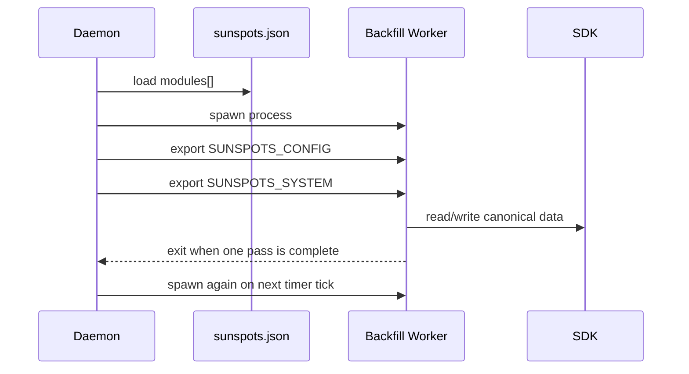
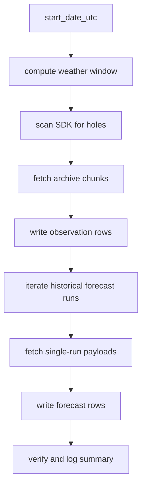
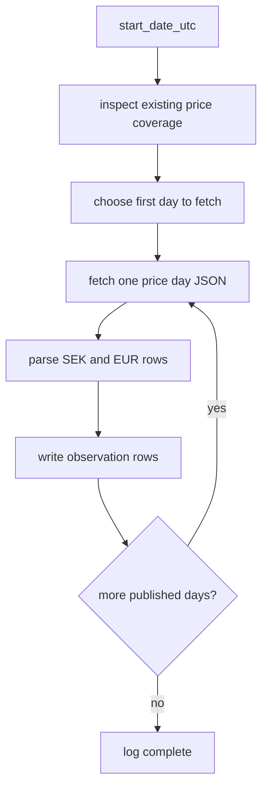

# Backfillers

This manual explains the backfill helpers.

It covers both current workers:

- `BackfillOpenMeteo`
- `BackfillElprisjustnu`

## What Backfill Is

Backfill is a daemon-managed ingest and repair subsystem under `src/backfill`.

It exists to do the jobs that one-shot live fetchers dont:

- filling historical gaps
- rebuilding canonical SDK coverage from a configured start date
- retrying politely
- writing through the SDK instead of talking to SQLite directly

Backfill is not a shared library loaded into the daemon process.

Each backfill worker is a separate executable process that the daemon spawns as a module.

## Current Workers

### Weather

Executable:

```text
build/debug/src/backfill/backfill_openmeteo
```

Purpose:

- fill historical weather observations from Open-Meteo archive API
- fill historical weather forecast-release coverage from Open-Meteo single-runs API

Writes:

- temperature
- cloud cover
- shortwave irradiance

### Price

Executable:

```text
build/debug/src/backfill/backfill_elprisetjustnu
```

Purpose:

- fill historical and currently published electricity prices
- act as the authoritative price ingester

Writes:

- `SS_METRIC_ENERGY_PRICE_SPOT_SEK_KWH`
- `SS_METRIC_ENERGY_PRICE_SPOT_EUR_KWH`

Important semantic rule:

- price is written as final observed data, not forecast

## Daemon Integration

The daemon owns backfill lifecycle.

Backfill workers do not parse their own config file anymore. They expect:

- `SUNSPOTS_CONFIG`
- `SUNSPOTS_SYSTEM`

from the daemon.

In `sunspots.json`, each backfill worker is a timer module with:

- `Timer-type: 1`
- `Rel-time: 3600`
- `start_at_boot: 1`

That means:

- run once shortly after daemon startup
- then run every hour



## Shared Runtime Model

All backfill workers use the same high-level pattern:

1. parse shared config from env
2. inspect SDK coverage
3. decide what range to fetch
4. fetch provider payloads
5. map payloads into canonical SDK records
6. write through the SDK
7. log summary and exit

## Config Model

Backfill reads:

- module-local worker config from `SUNSPOTS_CONFIG.backfill`
- shared location and SDK config from `SUNSPOTS_SYSTEM`

### Shared system config

```json
{
  "system": {
    "location": {
      "id": "stockholm-home",
      "name": "Stockholm",
      "latitude": 59.3293,
      "longitude": 18.0686,
      "elprisomrade": "SE3"
    },
    "sdk": {
      "db_dir": "db",
      "log_level": "info",
      "log_mirror_enabled": true,
      "log_mirror_path": "logs/sdk.log",
      "log_mirror_max_bytes": "5242880"
    }
  }
}
```

### Weather worker module entry

```json
{
  "name": "BackfillOpenMeteo",
  "bin_path": "./build/debug/src/backfill/backfill_openmeteo",
  "Timer-type": 1,
  "Rel-time": 3600,
  "start_at_boot": 1,
  "backfill": {
    "enabled": true,
    "start_date_utc": "2026-03-01",
    "chunk_days": 7,
    "retry_max_attempts": 5,
    "retry_base_backoff_ms": 1000,
    "freshness_lag_minutes": 120,
    "request_interval_ms": 250,
    "max_requests_per_minute": 240,
    "max_requests_per_hour": 2000,
    "max_requests_per_day": 8000,
    "progress_log_interval_sec": 10,
    "usage_daily_path": "logs/backfill_usage_daily.log"
  }
}
```

### Price worker module entry

```json
{
  "name": "BackfillElprisjustnu",
  "bin_path": "./build/debug/src/backfill/backfill_elprisetjustnu",
  "Timer-type": 1,
  "Rel-time": 3600,
  "start_at_boot": 1,
  "backfill": {
    "enabled": true,
    "start_date_utc": "2026-03-01",
    "retry_max_attempts": 5,
    "retry_base_backoff_ms": 1000,
    "request_interval_ms": 1000,
    "max_requests_per_minute": 20,
    "max_requests_per_hour": 200,
    "max_requests_per_day": 1000,
    "usage_daily_path": "logs/backfill_price_usage_daily.log",
    "endpoint": "https://www.elprisetjustnu.se/api/v1/prices"
  }
}
```

## Weather Backfill: How It Works

Weather backfill is the more complex worker.

It performs two separate jobs in one pass:

1. archive observation fill
2. forecast-history fill

That is why it can feel slow even for a "one week" request.

### Archive fill

The worker:

- computes the historical window from `start_date_utc` to the freshness-lag cutoff
- scans the SDK for holes in the three tracked weather metrics
- groups those holes into fetch ranges
- fetches Open-Meteo archive chunks
- writes canonical observation rows

### Forecast-history fill

Then it also:

- steps across historical forecast run times
- fetches single-run payloads
- writes canonical forecast rows using `run_utc` as release identity

This can produce a lot more data than the archive phase.



### Why weather looks slow

The worker is not just filling one week of observations.

It is also replaying many forecast runs across that same window.

So a user-visible request like "backfill one week" expands into:

- one week of archive observations
- plus many hourly forecast runs
- each run containing a forecast horizon

That is the main reason weather backfill is much heavier than price backfill.

## Price Backfill: How It Works

Price backfill is simpler.

The source publishes final fixed prices, not forecast releases.

So the worker does not create forecast-history rows. It writes final canonical observations.

High-level flow:

1. start from configured historical start date
2. inspect existing price coverage in the SDK
3. choose the earliest day that still needs fill
4. fetch day files from `elprisetjustnu`
5. write `SEK/kWh` and `EUR/kWh` as observed price rows
6. stop at the last currently published day



### Why price backfill is different from the old price fetcher

The new price worker fixes three old semantic problems:

1. it writes prices as observation, not forecast
2. it stores both SEK and EUR canonicals
3. it can fill historical coverage from a configured start date

### Upstream behavior

`elprisetjustnu` is sensitive to client fingerprint.

The new price worker fetches with a normal explicit `User-Agent`, because the generic fetch helper path was getting `403` for the same URL in this environment.

It also accepts the real upstream timestamp format:

```text
2026-03-09T00:00:00+01:00
```

## Shared Rate Limiting And Retry

Both workers implement:

- max requests per minute
- max requests per hour
- max requests per day
- base backoff retry
- per-request spacing

This is local self-throttling, not a guarantee about provider behavior.

### Weather defaults

Weather is configured for a relatively high but bounded archival fill rate.

### Price defaults

Price is configured much more conservatively:

- `request_interval_ms = 1000`
- `max_requests_per_minute = 20`
- `max_requests_per_hour = 200`
- `max_requests_per_day = 1000`

That is intentional because the price source is lighter weight and more sensitive operationally than the Open-Meteo archive API.

## Logging

Backfill logs through the SDK logging layer, so detailed runtime logs appear in the SDK mirror log, typically:

```text
logs/sdk.log
```

The daemon log only shows module lifecycle events like:

- `BackfillOpenMeteo »» Started.`
- `BackfillElprisjustnu »» Started.`

### Important weather events

- `backfill.config`
- `backfill.analyze`
- `backfill.no_holes`
- `backfill.fetch_retry`
- `backfill.complete`
- `backfill.partial`

### Important price events

- `backfill.price.config`
- `backfill.price.plan`
- `backfill.price_day_fetch_start`
- `backfill.price_day_fetch_complete`
- `backfill.price.complete`

### Operational note

Most detailed chunk/hole logs are `DEBUG` now.

At `INFO`, you get summaries. That keeps logs smaller, but it also means a long weather run can look quiet unless you watch the DB or enable `DEBUG`.

## What "Done" Means

### Weather

Weather is done when:

- the archive observation window from `start_date_utc` to the freshness-lag cutoff has no remaining required holes
- the worker has completed its forecast-history pass
- it logs `backfill.complete`

### Price

Price is done when:

- all published price day files from the chosen start day through the last currently published day are written
- the worker logs `backfill.price.complete`

Price is not "forecast complete". It is simply complete for the currently published authoritative window.

## Reading The DB After Backfill

After successful runs, you should expect:

- weather observations and forecast-history under the existing weather canonicals
- price observations under the existing price canonicals

Important note for price:

- if the old legacy price fetcher is still enabled, it can still write price rows as `forecast`
- that creates mixed semantics in the same DB
- the new price backfill itself writes only observed price rows

## What Module Authors Should Assume

If you build another backfill worker later:

1. Keep it daemon-managed.
2. Read config only from `SUNSPOTS_CONFIG` and `SUNSPOTS_SYSTEM`.
3. Write only through SDK APIs.
4. Use the existing canonical metrics. Do not invent parallel canonicals for the same concept.
5. Decide carefully whether the source is truly observation-like or forecast-release-like.
6. Log enough summary information that long runs are understandable from `sdk.log`.

## Final Picture

The backfill subsystem is the system's repair-and-history layer.

Weather backfill is currently the heavy worker because it combines archive repair and forecast-history replay.

Price backfill is the cleaner model:

- published fixed values
- authoritative canonical writes
- historical fill from a configured start date

That is the mental model to keep when reading or extending `src/backfill`.
