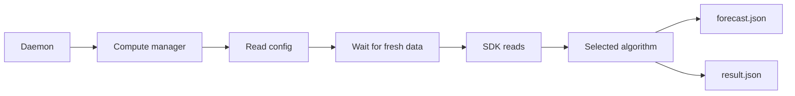

# Compute Guided Tour

This manual explains the compute subsystem under `src/compute` as it exists today.

It covers:

- what the compute manager is responsible for
- where its configuration comes from
- how it decides when input data is ready
- how algorithms are selected
- what gets written for downstream clients

The goal is to make the runtime behavior obvious.

## What The Compute Layer Is

The compute layer is the planning step of Sunspots.

It does not fetch provider data itself. Instead, it consumes canonical time-series data that has already been written into the SDK by fetchers and backfill workers.

Its job is to:

- wait until usable fresh input data exists
- load the relevant weather and price series
- align them into a fixed 15-minute horizon
- run a planning algorithm
- publish a client-facing result

The main executable is:

```text
build/debug/src/compute/sunspots_compute_manager
```

The algorithm implementations live in the `sunspots_compute` library.

## Runtime Model

The compute manager is a daemon-managed timer process.

At each run it performs one compute pass and exits.

High-level flow:

1. read module config from `SUNSPOTS_CONFIG`
2. wait for fresh observed weather data
3. load canonical weather and price series from the SDK
4. derive the usable 24-hour horizon
5. run the selected compute algorithm
6. write `forecast.json` and `result.json`



## Where Config Comes From

Unlike the fetchers, the compute manager reads its main control settings from `SUNSPOTS_CONFIG`.

Important fields today are:

- `compute_method`
- `exp_backoff_poll_rate`
- `exp_backoff_timeout`

These values control:

- which algorithm is used
- how often the process polls for fresh observed data
- how long it is willing to wait before failing the run

### Example module entry

```json
{
  "name": "ComputeManager",
  "bin_path": "./build/debug/src/compute/sunspots_compute_manager",
  "Timer-type": 1,
  "Rel-time": 60,
  "compute_method": 0,
  "exp_backoff_poll_rate": 3,
  "exp_backoff_timeout": 5400,
  "start_at_boot": 1
}
```

## Freshness Gate

The compute manager does not immediately calculate on every timer tick.

It first checks whether fresh observed weather data exists in the SDK. In current code it looks for recent observed values for:

- cloud cover
- air temperature

This is a pragmatic readiness gate. The intent is to avoid publishing a new plan if the live ingest side has not produced fresh inputs yet.

The wait loop uses exponential-backoff-style naming in config, but the current implementation polls at a fixed interval until the timeout window is reached.

## Loading The Compute Horizon

Once the readiness check passes, the manager loads canonical samples from the SDK for:

- shortwave radiation
- cloud cover
- air temperature
- spot price

The process computes a 24-hour window starting at the current 15-minute slot. Internally, arrays are sized for 96 slots, which corresponds to one day of quarter-hour values.

The loaded series are aligned by timestamp into the same slot index. The usable horizon length is then determined by scanning until one of the required inputs is missing.

That means compute only runs on the contiguous prefix of slots that has complete input coverage.

## Algorithms

The subsystem currently exposes two algorithms.

### Heuristic model

File:

```text
src/compute/algorithms/compute_heuristic.c
```

This model derives a simple PV availability estimate from:

- irradiance
- cloud cover
- temperature

It then combines that with price normalization to produce four normalized control outputs.

This approach is easy to follow and cheap to run, which makes it suitable as a baseline policy.

### Linear programming model

File:

```text
src/compute/algorithms/compute_lp.c
```

This model uses GLPK to solve a per-run optimization problem with decision variables for:

- buying electricity
- direct use
- charging the battery
- selling excess energy

The LP formulation adds explicit constraints and an objective based on electricity price, which makes it more structured than the heuristic model while still fitting the same result format.

## Why Algorithms Are Separate From The Manager

This is an important design choice.

The compute manager owns orchestration:

- config parsing
- waiting for readiness
- loading input series
- output serialization

The algorithm files own policy:

- how to interpret the inputs
- how to score or optimize a plan

That separation makes it possible to change the planning strategy without rewriting the process control logic around it.

## Output Contract

After a successful run, the compute manager writes two JSON files into the `endpoints` directory.

### `forecast.json`

This file contains the aligned input series that the compute run used:

- irradiance
- cloudiness
- temperature
- timestamp

### `result.json`

This file contains the recommendation outputs:

- `buy_electricity`
- `direct_use`
- `charge_battery`
- `sell_excess`
- `timestamp`

Values are normalized between 0 and 1. The JSON arrays are always sized to the full 96-slot shape, with unused tail values represented as `null` when the valid horizon is shorter.

This is a pragmatic serving contract: the frontend and terminal client can consume ready-made JSON without understanding the SDK schema.

## Design Choices That Matter

### Canonical reads only

The compute layer does not know where data originally came from. It reads canonical SDK series, which keeps the planning logic independent of provider-specific payload formats.

### Fixed slot model

Everything is aligned to 15-minute slots. This avoids ad hoc timestamp handling inside the algorithms and matches the rest of the system's storage model.

### File output for serving

The compute manager writes endpoint files instead of serving directly from the compute process. That keeps the frontend simpler and decouples planning from client delivery.

## What Compute Is Not Responsible For

The compute subsystem is not responsible for:

- fetching provider payloads
- repairing historical gaps
- maintaining long-lived client connections
- storing user interface state

Those jobs belong to fetchers, backfill workers, and frontend/client code.