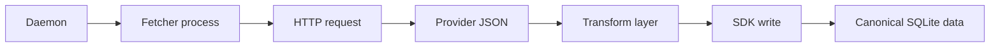

# Fetchers Guided Tour

This manual explains the fetcher modules under `src/fetch` as they exist today.

It covers:

- what the fetchers are responsible for
- which fetchers currently exist
- where their runtime config comes from
- how provider JSON becomes canonical SDK records
- what technical boundaries the fetch layer is built around

The goal is to describe the runtime model, not just list the files.

## What The Fetch Layer Is

The fetch layer is the live-ingest side of Sunspots.

Each fetcher is a small daemon-managed executable that does one provider-specific job:

- read shared runtime config from the environment
- build a provider URL
- perform an HTTP request
- parse the response JSON
- transform it into Sunspots internal models
- write canonical records through the SDK
- exit

Fetchers are intentionally short-lived processes. They are started by the daemon on a timer, do one pass of work, and terminate.

## Current Fetchers

### Weather observations

Executable:

```text
build/debug/src/fetch/apis/sunspots_fetch_openmeteo
```

Purpose:

- fetch current and recent weather data from Open-Meteo
- write canonical weather observations into the SDK

Writes:

- shortwave radiation
- cloud cover
- air temperature

### Weather forecast

Executable:

```text
build/debug/src/fetch/apis/sunspots_fetch_openmeteo_forecast
```

Purpose:

- fetch forecast weather data from Open-Meteo
- write canonical weather forecast rows into the SDK

Writes:

- shortwave radiation forecast
- cloud cover forecast
- air temperature forecast

Important semantic rule:

- these rows are written as forecast data, not observations

### Electricity price

Executable:

```text
build/debug/src/fetch/apis/sunspots_fetch_elprisjustnu
```

Purpose:

- fetch spot prices for the configured Swedish price area
- write canonical electricity price rows into the SDK

Writes:

- `SS_METRIC_ENERGY_PRICE_SPOT_SEK_KWH`
- in current code, price is treated as published market data rather than weather-style forecast history

## Daemon Integration

The daemon owns fetcher lifecycle.

Fetchers are configured in `config/sunspots.json` as timer modules. In the current setup they run on short relative timers and can start immediately when the daemon starts.

At spawn time, the daemon exports:

- `SUNSPOTS_SYSTEM` for shared location and SDK config
- `SUNSPOTS_CONFIG` for module-local settings if the module needs them

Fetchers do not talk directly to each other, and they do not call the compute module. Their only shared contract is the SDK.



## Where Config Comes From

Fetchers primarily read shared settings from `SUNSPOTS_SYSTEM`.

Important fields today are:

- `system.location.latitude`
- `system.location.longitude`
- `system.location.elprisomrade`
- `system.sdk.*`

In practice this means:

- Open-Meteo fetchers use latitude and longitude to build query URLs
- the Elprisjustnu fetcher uses `elprisomrade` to choose the correct price area
- all fetchers rely on shared SDK config for database and logging behavior

### Example system block

```json
{
  "system": {
    "location": {
      "id": "stockholm-home",
      "name": "Stockholm",
      "latitude": 59.3293,
      "longitude": 18.0686,
      "elprisomrade": "SE3"
    },
    "sdk": {
      "db_dir": "db",
      "log_level": "info",
      "log_mirror_enabled": true,
      "log_mirror_path": "logs/sdk.log",
      "log_mirror_max_bytes": "5242880"
    }
  }
}
```

## Runtime Shape

Although each provider has its own parsing code, the fetchers follow the same high-level structure:

1. parse env config
2. build provider URL
3. fetch JSON using the shared HTTP helper
4. transform JSON into a provider-neutral model
5. convert each point into SDK records
6. write records to the location database

The shared HTTP helper lives in `fetch_utils.h` and wraps the internal `curly` client with a polling loop and timeout.

## Why Transform Exists As A Separate Step

Fetchers do not write provider JSON straight into storage.

Instead, they pass the parsed payload into the transform layer first.

That boundary is useful because it keeps three concerns separate:

- transport: downloading bytes from an upstream API
- interpretation: mapping provider field names and units into internal models
- persistence: writing canonical records into the SDK

This makes it easier to replace a provider without rewriting the whole ingest path. It also prevents the compute layer from needing to know anything about external API formats.

## Write Semantics

Fetchers write one canonical record at a time through SDK factory functions such as:

- `ss_sdk_record_make_f64`
- `ss_sdk_db_write_record`

That gives them several properties automatically:

- timestamps are aligned to the system's 15-minute slot model
- metric ids are validated centrally
- observations and forecasts are stored with consistent SDK semantics
- all modules share the same read model later

This is an important design choice. The fetch layer is not a raw SQLite writer and not a file-dump layer. Its job is to ingest external data into the system's canonical database contract.

## Design Choices That Matter

### Small executables instead of one generic fetch service

The current design prefers one small executable per source or source-mode.

That keeps each module easy to reason about and easy to restart independently, even if it does mean some repeated control flow across fetchers.

### Shared storage contract

Fetchers do not publish directly to clients.

They only publish to the SDK database. This keeps upstream ingestion decoupled from downstream planning and serving.

### Short-lived processes

A fetcher does one unit of work and exits.

That matches the daemon's timer model well and avoids carrying long-lived provider state between runs.

## What Fetchers Are Not Responsible For

Fetchers are not responsible for:

- historical repair over large time windows
- replaying many old forecast runs
- deciding the user recommendation policy
- serving HTTP responses to clients

Those concerns belong to backfill, compute, and frontend modules respectively.