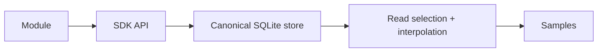
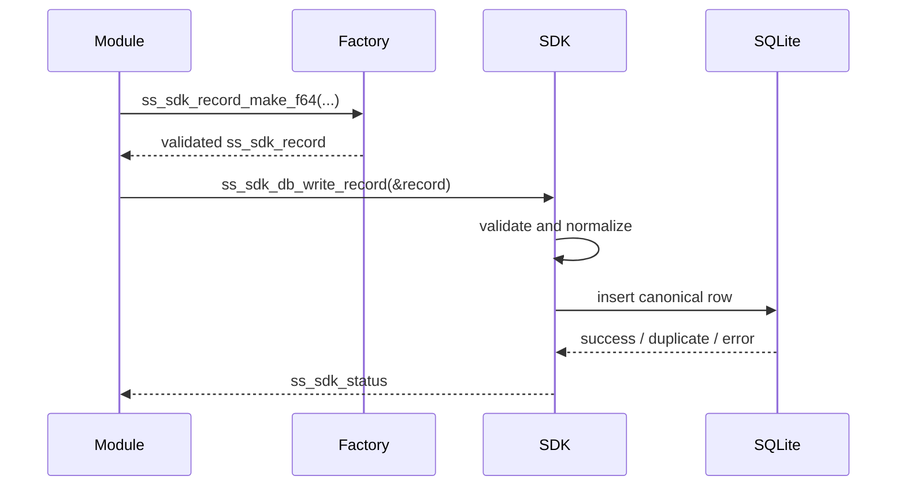
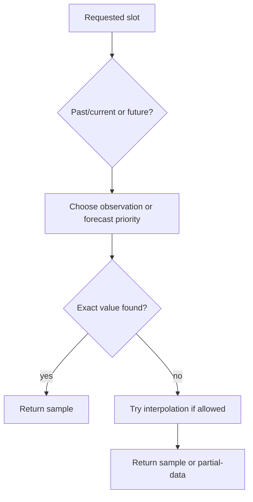
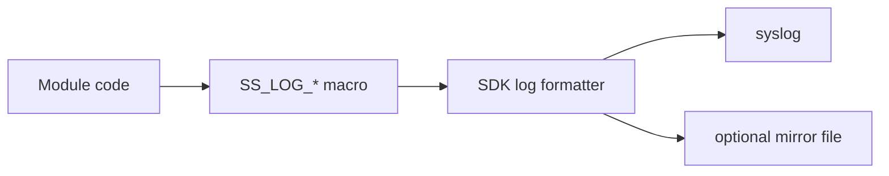

# Sunspots SDK

The SDK is the canonical persistence and logging layer shared by the modules.

The SDK is responsible for:

- validating canonical metric writes
- aligning timestamps to the 15-minute slot model
- storing records in a location-scoped SQLite database
- selecting the best record for a read request
- interpolating where the canonical policy allows it
- writing structured logs

## Mental Model



## Global Config

The SDK reads shared runtime config from the `SUNSPOTS_SYSTEM` environment variable. That shared config originates from the system config file, but by the time a module runs, the daemon has exported it as environment data. This is how all modules can use the same database location and log mirror file.

## Opening And Closing The DB

The goal is to keep the public API simple for module authors: they should be able to call the SDK functions they need without creating, passing around, or closing a database handle themselves.

This is why the SDK opens the DB lazily. The database is not opened when the process starts. Instead, the first SDK read or write call opens it automatically.

Internally, the SDK keeps the SQLite handle in process-local library state. On later read and write calls, it checks that internal state and reuses the already opened handle instead of opening a new database connection each time. The handle stays open for the lifetime of the process.

Shutdown is also automatic. The SDK registers an `atexit` cleanup handler, so when the process exits normally, the SDK closes the database and tears down its internal runtime state without the module needing to do that explicitly.

## The Storage Model

Everything is stored as canonical records, with one row per canonical slot value.

This model is what allows the SDK to store both observations and forecasts, including multiple forecast releases for the same slot when they have different `ingested_utc` values.

This storage model is also a deliberate database design choice. A very wide table with one column per metric would be harder to evolve, harder to validate cleanly, and inefficient for the kind of sparse time-series data the SDK stores. By storing canonical values as rows instead, the SDK can rely on normal SQL mechanisms such as indexes and query planning rather than baking a rigid storage layout into the schema.

That does mean retrieval sometimes does more work at read time, but that is an acceptable tradeoff here. We only read and write once per 15 minute slot during normal operations. The SDK does not optimize for the simplest possible raw storage lookup at any cost. It optimizes for correctness, extensibility, and one consistent canonical contract, while still letting SQLite do the normal database optimization work underneath.

A record contains:

- canonical metric id
- value type and value
- `ts_start_utc`
- `ts_end_utc`
- `data_kind`
- `ingested_utc`

The SDK uses fixed 15-minute slots as the canonical time model.

That means:

- input timestamps are aligned down to slot boundaries by the factory functions
- `ts_end_utc` is derived automatically as `ts_start_utc + 900`

### Important Distinction: `data_kind`

The SDK supports two meanings for a row:

- `SS_SDK_DATA_OBSERVATION`
- `SS_SDK_DATA_FORECAST`

This is useful for weather because the same canonical can exist as both:

- observed truth
- forecast release data

But it is not appropriate for every canonical. For example, electricity prices should generally be written as final observed values once published. This is a caller policy today rather than a canonical-specific rule enforced by the SDK factories.

## Writing Data

Callers should use the factory functions:

- `ss_sdk_record_make_f64`
- `ss_sdk_record_make_i64`
- `ss_sdk_record_make_bool`

These factories validate:

- canonical exists
- value type matches the canonical
- timestamp is aligned to the slot model

More validation could be added here in the future, but this is the current state.

Then callers write using:

- `ss_sdk_db_write_record`
- or `ss_sdk_db_write_records`

### Single Write Flow



### `ingested_utc`

`ingested_utc` is public, but most modules do not need to set it manually.

Factory functions initialize it to `0`.

The write behavior is:

- observation with `ingested_utc == 0` stays `0`
- forecast with `ingested_utc == 0` gets a write-time ingest timestamp

That preserves backward compatibility for existing writers while still supporting forecast release identity.

### Duplicate Rules

The DB uniqueness rule includes:

- canonical
- data kind
- slot start
- `ingested_utc`

That means:

- exact duplicate observation rows dedupe cleanly
- forecast releases can coexist when they have different ingest/release timestamps

This is important because it preserves forecast history instead of overwriting it. That means we can later reconstruct what the forecast looked like at a specific point in time for each slot. This makes backtesting possible: we can compare the forecast versions that were actually available at the time against the observations that later became true, and measure how accurate the forecasts were.

## Reading Data

The main read entry point is:

```c
ss_sdk_db_get_canonical(from_utc, quarters_to_fetch, canonical, &out)
```

### Read Shapes

- `from_utc == 0`
  - start from the current 15-minute slot
- `from_utc > 0`
  - floor-align to the slot model
- `quarters_to_fetch > 0`
  - bounded read
- `quarters_to_fetch == 0`
  - forward-horizon read

### Bounded Vs Forward Reads

Bounded reads ask for an explicit slot count.

Forward reads ask for:

- all available data from the chosen start slot forward

If a bounded read asks for more than the DB actually has, the SDK clamps it to the available window.

That is why the SDK now has these distinct statuses:

- `SS_SDK_OK`
- `SS_SDK_CLAMPED`
- `SS_SDK_ERR_PARTIAL_DATA`
- `SS_SDK_CLAMPED_PARTIAL_DATA`

### How A Read Chooses A Value

The SDK does not simply return the first row it finds.

For each requested slot, it applies selection rules based on:

- whether the slot is in the past/current or future
- whether observation exists
- whether forecast exists
- whether interpolation is allowed for that canonical



For past and current slots:

- prefer observation
- if no observation exists, try forecast
- if neither exists, try interpolation if that canonical allows it

For future slots:

- prefer forecast
- for step-policy canonicals, an exact observation row may still be used
- if no exact value exists, try interpolation if that canonical allows it

This public read API is currently optimized for making downstream consumers such as the calculator easy to implement. The caller asks for one canonical series, and the SDK returns the best usable values according to the shared selection policy.

That also means the API is not currently designed for forecast-history analysis as a first-class use case. Past forecast rows can exist in storage, but the public read API does not let the caller explicitly request "forecast only" data for past slots when an observation also exists. If we want to support that kind of backtesting or forecast-version analysis directly, the SDK API will need to be extended with a more explicit query mode.

## Interpolation

Interpolation policy is fixed per canonical.

Three broad policies exist:

- `linear`
- `step`
- `none`

Typical use:

- many continuous weather metrics: linear
- spot prices: step
- discrete symbols / booleans: none

Interpolation is not unlimited.

Important limit:

- if the gap is too large, the SDK does not fabricate a value
- the read returns partial-data status instead

The interpolation limit is a hard cap of 6 hours. If filling a gap would require interpolation beyond that limit, the SDK does not fabricate a value and the read returns partial-data instead.

In practice, linear interpolation is used for selected `f64` canonicals, while step interpolation uses the latest earlier value within the allowed gap. Future-slot fallback to exact observation rows is only allowed for step-policy metrics such as spot price.

This is why raw storage can be hourly while reads still produce quarter-hour samples. The SDK can interpolate on the read path when the canonical policy says that is valid.

## Logging

The SDK provides structured logging helpers:

- `SS_LOG_DEBUG`
- `SS_LOG_INFO`
- `SS_LOG_WARN`
- `SS_LOG_ERROR`

Logs go through the SDK logging layer, which writes to:

- the system `syslog()` interface
- optional mirror file

Mirror settings come from `system.sdk` or the equivalent exported env vars.

Default mirror file:

```text
logs/sdk.log
```

### Logging Flow



The SDK also emits its own lifecycle logs such as:

- `sdk.started`
- `sdk.shutdown`

## Process Lifetime

The SDK is process-scoped.

That means:

- each module process has its own SDK runtime
- one module process cannot shut down another process's SDK

The SDK uses internal `atexit` cleanup. Normal module code does not need to manage SDK shutdown in production flow.

## What Module Authors Should Assume

If you are writing a module on top of the SDK:

1. Get shared runtime config from `SUNSPOTS_SYSTEM`, not from ad hoc env vars.
2. Use the record factory functions. Do not hand-build canonical records. If functionality is missing we extend the SDK, we dont "handroll" records.
3. Treat `PARTIAL_DATA` and `CLAMPED_*` as meaningful results, not as random failures.
4. Write final authoritative data as `observation`.
5. Only use `forecast` when the source truly has release semantics.
6. Let the SDK handle interpolation. Do not pre-interpolate provider payloads into fake canonical samples.

## Short Usage Examples

### Write One Observation

```c
ss_sdk_record rec;
ss_sdk_status st;

st = ss_sdk_record_make_f64(
    &rec,
    SS_METRIC_WEATHER_TEMPERATURE_AIR_2M_C,
    7.5,
    /* Prefer the API timestamp when available. */
    (int64_t)time(NULL),
    SS_SDK_DATA_OBSERVATION
);
if (st != SS_SDK_OK) {
    return st;
}

st = ss_sdk_db_write_record(&rec);
if (st != SS_SDK_OK) {
    return st;
}
```

### Read Forward Horizon

```c
ss_sdk_samples_out out = {0};
ss_sdk_status st;

st = ss_sdk_db_get_canonical(
    0,
    0,
    SS_METRIC_WEATHER_TEMPERATURE_AIR_2M_C,
    &out
);
if (st != SS_SDK_OK &&
    st != SS_SDK_CLAMPED &&
    st != SS_SDK_ERR_PARTIAL_DATA &&
    st != SS_SDK_CLAMPED_PARTIAL_DATA) {
    return st;
}

/* use out.samples */
ss_sdk_db_free_samples(&out);
```

## Final Picture

The SDK is the canonical contract boundary of the system.

Provider-specific modules may be imperfect, but once data crosses into the SDK it should be:

- canonical
- slot-aligned
- queryable with stable semantics
- readable through one shared selection/interpolation model

That is the core idea to keep in mind when reading or extending the rest of the system.
