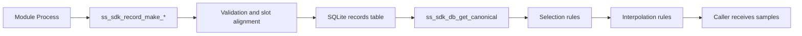
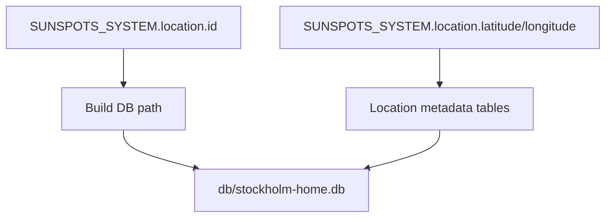
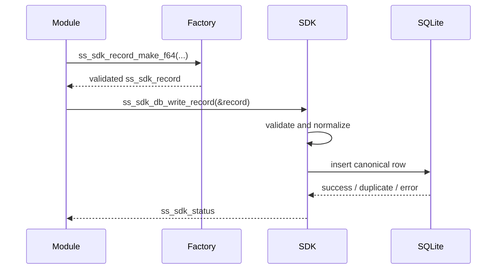
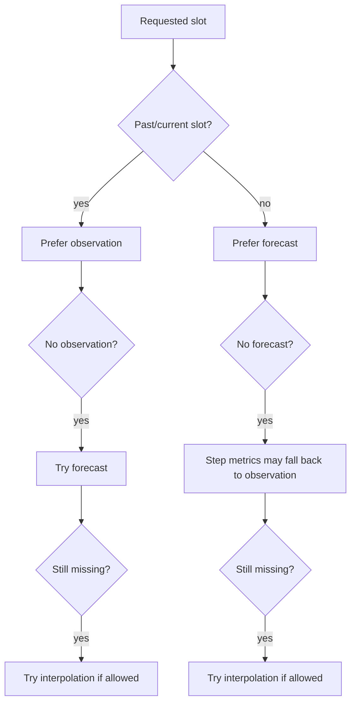
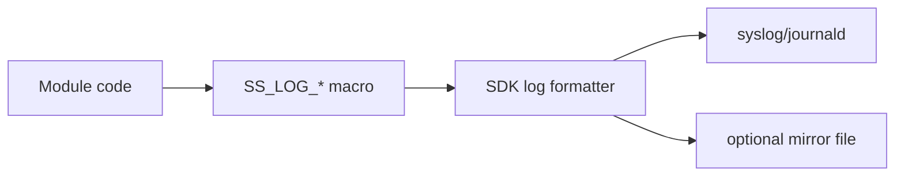

# SDK Guided Tour

This is a guided tour of the Sunspots SDK as it exists today.

It explains:

- where SDK config comes from
- how the database is chosen
- what gets written into SQLite
- how reads decide between observations, forecasts, and interpolation
- how logging works
- what module authors should assume when they use the SDK

This is intentionally more than a usage cheat sheet. The goal is to make the runtime model obvious.

## What The SDK Is

The SDK is the canonical persistence and logging layer shared by Sunspots modules.

A module does not talk to SQLite directly. It talks to the SDK.

The SDK is responsible for:

- validating canonical metric writes
- aligning timestamps to the 15-minute slot model
- storing records in a location-scoped SQLite database
- selecting the best record for a read request
- interpolating where the canonical policy allows it
- writing structured logs

The SDK is not responsible for:

- parsing provider payloads
- deciding when an external source should be fetched
- source-specific unit interpretation

Those are fetch/transform/backfill concerns.

## Mental Model

Think of the SDK as a per-process canonical time-series service with one SQLite file behind it.



Every module process gets:

- one SDK runtime
- one lazily opened SQLite handle
- one location-scoped DB file

The SDK state is process-local. One module process cannot shut down another process's SDK state.

## Where Config Comes From

The SDK reads shared runtime config from `SUNSPOTS_SYSTEM`, not from module-local `SUNSPOTS_CONFIG`.

The important paths are:

- `system.location.id`
- `system.location.latitude`
- `system.location.longitude`
- `system.location.name`
- `system.location.elprisomrade`
- `system.sdk.db_dir`
- `system.sdk.log_level`
- `system.sdk.log_mirror_enabled`
- `system.sdk.log_mirror_path`
- `system.sdk.log_mirror_max_bytes`

At runtime, the daemon exports the top-level `system` block as `SUNSPOTS_SYSTEM` when it spawns a module.

### Example

```json
{
  "system": {
    "location": {
      "id": "stockholm-home",
      "name": "Stockholm",
      "latitude": 59.3293,
      "longitude": 18.0686,
      "elprisomrade": "SE3"
    },
    "sdk": {
      "db_dir": "db",
      "log_level": "info",
      "log_mirror_enabled": true,
      "log_mirror_path": "logs/sdk.log",
      "log_mirror_max_bytes": "5242880"
    }
  }
}
```

## How The Database Is Chosen

The DB identity comes from `system.location.id`.

The filename is:

```text
<db_dir>/<location_id>.db
```

Example:

```text
db/stockholm-home.db
```

Latitude and longitude are still stored as location metadata, but they are not the DB key anymore.

That matters because:

- the SDK no longer imposes a rounding policy on location identity
- two nearby houses can have different DBs if they have different `location.id`
- the DB name follows the config authority, not a derived coordinate precision



## When The DB Opens

The SDK opens the DB lazily.

That means the DB is not opened when the process starts. It opens on the first real read, write, or log path that needs SDK runtime.

On open, the SDK:

- resolves the DB path
- creates parent directories if needed
- opens SQLite
- applies SQLite pragmas
- ensures the schema exists
- syncs location metadata

Important SQLite settings:

- `journal_mode=WAL`
- `synchronous=NORMAL`
- `busy_timeout=5000`
- `wal_autocheckpoint=1000`

## The Storage Model

Everything is stored as canonical records.

A record contains:

- canonical metric id
- value type and value
- `ts_start_utc`
- `ts_end_utc`
- `data_kind`
- `ingested_utc`

The SDK uses fixed 15-minute slots as the canonical time model.

That means:

- input timestamps are aligned down to slot boundaries by the factory functions
- `ts_end_utc` is derived automatically as `ts_start_utc + 900`

### Important Distinction: `data_kind`

The SDK supports two meanings for a row:

- `SS_SDK_DATA_OBSERVATION`
- `SS_SDK_DATA_FORECAST`

This is useful for weather because the same canonical can exist as both:

- observed truth
- forecast release data

But it is not appropriate for every canonical. For example, electricity prices should be written as final observed values once published.

## Writing Data

Most callers should use the factory functions:

- `ss_sdk_record_make_f64`
- `ss_sdk_record_make_i64`
- `ss_sdk_record_make_bool`

These factories validate:

- canonical exists
- value type matches the canonical
- timestamp is aligned to the slot model

Then callers write using:

- `ss_sdk_db_write_record`
- or `ss_sdk_db_write_records`

### Single Write Flow



### `ingested_utc`

`ingested_utc` is public, but most modules do not need to set it manually.

Factory functions initialize it to `0`.

The write behavior is:

- observation with `ingested_utc == 0` stays `0`
- forecast with `ingested_utc == 0` gets a write-time ingest timestamp

That preserves backward compatibility for existing writers while still supporting forecast release identity.

### Duplicate Rules

The DB uniqueness rule includes:

- canonical
- data kind
- slot start
- `ingested_utc`

That means:

- exact duplicate observation rows dedupe cleanly
- forecast releases can coexist when they have different ingest/release timestamps

## Reading Data

The main read entry point is:

```c
ss_sdk_db_get_canonical(from_utc, quarters_to_fetch, canonical, &out)
```

### Read Shapes

- `from_utc == 0`
  - start from the current 15-minute slot
- `from_utc > 0`
  - floor-align to the slot model
- `quarters_to_fetch > 0`
  - bounded read
- `quarters_to_fetch == 0`
  - forward-horizon read

### Bounded Vs Forward Reads

Bounded reads ask for an explicit slot count.

Forward reads ask for:

- all available data from the chosen start slot forward

If a bounded read asks for more than the DB actually has, the SDK clamps it to the available window.

That is why the SDK now has these distinct statuses:

- `SS_SDK_OK`
- `SS_SDK_CLAMPED`
- `SS_SDK_ERR_PARTIAL_DATA`
- `SS_SDK_CLAMPED_PARTIAL_DATA`

### How A Read Chooses A Value

The SDK does not simply return the first row it finds.

For each requested slot, it applies selection rules based on:

- whether the slot is in the past/current or future
- whether observation exists
- whether forecast exists
- whether interpolation is allowed for that canonical



## Interpolation

Interpolation policy is fixed per canonical.

Three broad policies exist:

- `linear`
- `step`
- `none`

Typical use:

- weather metrics: linear
- spot prices: step
- discrete symbols / booleans: none

Interpolation is not unlimited.

Important limit:

- if the gap is too large, the SDK does not fabricate a value
- the read returns partial-data status instead

This is why raw storage can be hourly while reads still produce quarter-hour samples. The SDK can interpolate on the read path when the canonical policy says that is valid.

## Logging

The SDK provides structured logging helpers:

- `SS_LOG_DEBUG`
- `SS_LOG_INFO`
- `SS_LOG_WARN`
- `SS_LOG_ERROR`

Logs go through the SDK logging layer, which writes to:

- syslog / journald
- optional mirror file

Mirror settings come from `system.sdk` or the equivalent exported env vars.

Default mirror file:

```text
logs/sdk.log
```

### Logging Flow



The SDK also emits its own lifecycle logs such as:

- `sdk.started`
- `sdk.shutdown`

## Process Lifetime

The SDK is process-scoped.

That means:

- each module process has its own SDK runtime
- one module process cannot shut down another process's SDK

The SDK uses internal `atexit` cleanup. Normal module code does not need to manage SDK shutdown in production flow.

## What Module Authors Should Assume

If you are writing a module on top of the SDK:

1. Get shared runtime config from `SUNSPOTS_SYSTEM`, not from ad hoc env vars.
2. Use the record factory functions. Do not hand-build canonical records unless you really have to.
3. Treat `PARTIAL_DATA` and `CLAMPED_*` as meaningful results, not as random failures.
4. Write final authoritative data as `observation`.
5. Only use `forecast` when the source truly has release semantics.
6. Let the SDK handle interpolation. Do not pre-interpolate provider payloads into fake canonical samples unless that is explicitly intended.

## Short Usage Examples

### Write One Observation

```c
ss_sdk_record rec;
ss_sdk_status st;

st = ss_sdk_record_make_f64(
    &rec,
    SS_METRIC_WEATHER_TEMPERATURE_AIR_2M_C,
    7.5,
    (int64_t)time(NULL),
    SS_SDK_DATA_OBSERVATION
);
if (st != SS_SDK_OK) {
    return st;
}

st = ss_sdk_db_write_record(&rec);
if (st != SS_SDK_OK) {
    return st;
}
```

### Read Forward Horizon

```c
ss_sdk_samples_out out = {0};
ss_sdk_status st;

st = ss_sdk_db_get_canonical(
    0,
    0,
    SS_METRIC_WEATHER_TEMPERATURE_AIR_2M_C,
    &out
);
if (st != SS_SDK_OK &&
    st != SS_SDK_CLAMPED &&
    st != SS_SDK_ERR_PARTIAL_DATA &&
    st != SS_SDK_CLAMPED_PARTIAL_DATA) {
    return st;
}

/* use out.samples */
ss_sdk_db_free_samples(&out);
```

## Final Picture

The SDK is the canonical contract boundary of the system.

Provider-specific modules may be imperfect, but once data crosses into the SDK it should be:

- canonical
- slot-aligned
- queryable with stable semantics
- readable through one shared selection/interpolation model

That is the core idea to keep in mind when reading or extending the rest of the system.
